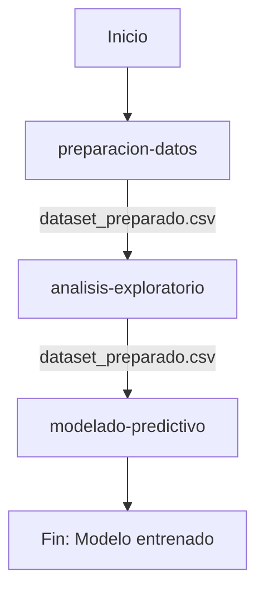

# Agente Predictor Premier League

## Descripción General

Sistema agéntico de análisis predictivo especializado en predicción de resultados de partidos de la Premier League. El agente coordina tres skills complementarias que forman un pipeline completo de Machine Learning: desde preparación de datos hasta modelado predictivo.

**Dataset**: `premier_league.db` - 380 partidos reales de la Premier League  
**Objetivo**: Predecir el resultado de cada partido (Local, Empate, Visitante)  
**Tecnología**: Python 3.x con pandas, scikit-learn, matplotlib, seaborn

---

## Skills Disponibles

### 1. **preparacion-datos**
**Descripción**: Carga datos de partidos de Premier League desde SQLite, limpia el dataset y calcula features históricas como promedio de goles y racha de victorias para preparar los datos para modelado predictivo.

**Input**: 
- `premier_league.db` - Base de datos SQLite con tabla `fixtures` con 380 partidos completados

**Output**:
- `data/dataset_preparado.csv` - Dataset enriquecido con features históricas
- `dataset_preparado` - DataFrame de pandas con estructura:
  - Columnas base: `id`, `fecha`, `equipo_local`, `equipo_visitante`, `goles_local`, `goles_visitante`
  - Features históricas: `promedio_goles_local`, `promedio_goles_visitante`, `racha_local`, `racha_visitante`, `ventaja_local`
  - Variable objetivo: `resultado` (Local/Empate/Visitante)

**Funciones principales**:
- Carga de datos desde SQLite
- Limpieza y validación de datos
- Cálculo de features históricas (últimos 5 partidos)
- Creación de variable objetivo

---

### 2. **analisis-exploratorio**
**Descripción**: Ejecuta análisis exploratorio sobre el dataset preparado de Premier League, genera estadísticas descriptivas, distribución de resultados, top equipos y visualizaciones guardadas como imágenes PNG.

**Input**:
- `data/dataset_preparado.csv` - Dataset preparado por skill de preparacion-datos

**Output**:
- `data/reporte_eda.json` - Reporte JSON con hallazgos principales:
  - Estadísticas generales del dataset
  - Distribución de la variable objetivo
  - Análisis de equipos dominantes
  - Correlaciones entre features
  - Conclusiones del análisis
- Visualizaciones PNG:
  - `graphs/01_distribucion_resultados.png` - Countplot de resultados
  - `graphs/02_promedio_goles_equipos.png` - Comparativa local vs visitante (top 10 equipos)
  - `graphs/03_heatmap_correlacion.png` - Matriz de correlación entre features

**Funciones principales**:
- Estadísticas descriptivas generales
- Análisis de distribución de resultados
- Identificación de top equipos (local y visitante)
- Matriz de correlación
- Generación de 3 gráficas exploratorias

---

### 3. **modelado-predictivo**
**Descripción**: Entrena LogisticRegression y RandomForestClassifier para predecir resultados de partidos (Local/Empate/Visitante), evalúa con accuracy/precision/recall, selecciona el mejor modelo y genera reporte.

**Input**:
- `data/dataset_preparado.csv` - Dataset preparado por skill de preparacion-datos

**Output**:
- `data/reporte_modelado.json` - Reporte JSON con resultados:
  - Mejor modelo seleccionado
  - Métricas de desempeño (accuracy, precision, recall)
  - Análisis comparativo entre modelos
  - Recomendaciones de uso
- Visualizaciones PNG:
  - `graphs/04_matriz_confusion_logisticregression.png` - Matriz de confusión LR
  - `graphs/04_matriz_confusion_randomforestclassifier.png` - Matriz de confusión RF
  - `graphs/05_comparacion_modelos.png` - Comparación de métricas entre modelos

**Modelos entrenados**:
- **LogisticRegression**: Modelo lineal multinomial con regularización L2
- **RandomForestClassifier**: Ensemble de 100 árboles de decisión

**Funciones principales**:
- Preparación de features para modelado
- División entrenamiento/prueba (80/20, stratificado)
- Escalado de features (StandardScaler)
- Entrenamiento de modelos
- Evaluación con métricas multiclass
- Selección del mejor modelo

---

## Flujo de Ejecución



### Secuencia de Ejecución:
1. **preparacion-datos**: Carga `premier_league.db` → genera `dataset_preparado.csv`
2. **analisis-exploratorio**: Lee `dataset_preparado.csv` → genera `reporte_eda.json` + 3 gráficas
3. **modelado-predictivo**: Lee `dataset_preparado.csv` → genera `reporte_modelado.json` + 3 gráficas

### Archivos de Configuración:
- `notebooks/pipeline_agentico.ipynb` - Orquestador interactivo del agente
- `skills/preparacion/preparacion.py` - Skill de preparación
- `skills/eda/eda.py` - Skill de análisis exploratorio
- `skills/modelado/modelado.py` - Skill de modelado
- `skills/preparacion/SKILL.md` - Documentación skill preparación
- `skills/eda/SKILL.md` - Documentación skill EDA
- `skills/modelado/SKILL.md` - Documentación skill modelado

---

## Estructura del Proyecto

```
ProyectoAgentico_BDFutbol/
├── AGENTS.md                          (este archivo)
├── data/
│   ├── premier_league.db              (base de datos fuente)
│   ├── dataset_preparado.csv          (generado por preparacion-datos)
│   ├── reporte_eda.json               (generado por analisis-exploratorio)
│   └── reporte_modelado.json          (generado por modelado-predictivo)
├── graphs/
│   ├── 01_distribucion_resultados.png
│   ├── 02_promedio_goles_equipos.png
│   ├── 03_heatmap_correlacion.png
│   ├── 04_matriz_confusion_logisticregression.png
│   ├── 04_matriz_confusion_randomforestclassifier.png
│   └── 05_comparacion_modelos.png
├── notebooks/
│   └── pipeline_agentico.ipynb        (orquestador)
└── skills/
    ├── preparacion/
    │   ├── SKILL.md                   (documentación)
    │   └── preparacion.py             (implementación)
    ├── eda/
    │   ├── SKILL.md                   (documentación)
    │   └── eda.py                     (implementación)
    └── modelado/
        ├── SKILL.md                   (documentación)
        └── modelado.py                (implementación)
```

---

## Ejecución Manual de Skills

Cada skill puede ejecutarse independientemente:

### Preparación de Datos
```bash
python skills/preparacion/preparacion.py "C:/path/to/premier_league.db"
```

### Análisis Exploratorio
```bash
python skills/eda/eda.py
```

### Modelado Predictivo
```bash
python skills/modelado/modelado.py
```

---

## Ejecución a través del Notebook

El notebook `notebooks/pipeline_agentico.ipynb` orquesta la ejecución completa:

1. **Celda 1**: Introducción al sistema agéntico
2. **Celda 2**: Carga y muestra las definiciones de skills desde SKILL.md
3. **Celda 3**: Ejecuta preparacion-datos con subprocess
4. **Celda 4**: Ejecuta analisis-exploratorio
5. **Celda 5**: Ejecuta modelado-predictivo
6. **Celda 6**: Carga y muestra `reporte_modelado.json`
7. **Celda 7**: Muestra las gráficas generadas

---

## Dependencias

### Python 3.x
- `pandas` - Manipulación de datos
- `numpy` - Cálculos numéricos
- `sqlite3` - Acceso a base de datos
- `scikit-learn` - Machine learning
- `matplotlib` - Visualizaciones
- `seaborn` - Visualizaciones avanzadas

### Instalación
```bash
pip install pandas numpy scikit-learn matplotlib seaborn
```

---

## Notas Técnicas

### Features Utilizadas para Predicción
- `promedio_goles_local`: Promedio de goles del equipo local en últimos 5 partidos como local
- `promedio_goles_visitante`: Promedio de goles del equipo visitante en últimos 5 partidos como visitante
- `racha_local`: Número de victorias del equipo local en últimos 5 partidos
- `racha_visitante`: Número de victorias del equipo visitante en últimos 5 partidos
- `ventaja_local`: Indicador binario de ventaja de campo (siempre 1)

### Clases Objetivo
- `Local`: Victoria del equipo local (goles_local > goles_visitante)
- `Empate`: Resultado igualado (goles_local == goles_visitante)
- `Visitante`: Victoria del equipo visitante (goles_local < goles_visitante)

### Métricas de Evaluación
- **Accuracy**: Proporción de predicciones correctas
- **Precision**: Proporción de predicciones positivas que fueron correctas
- **Recall**: Proporción de verdaderos positivos identificados
- **Matriz de Confusión**: Distribución de errores por clase

---

## Mejoras Futuras

1. **Feature Engineering**: Agregar features adicionales como forma reciente, ausentias de jugadores clave, etc.
2. **Validación Cruzada**: Implementar k-fold cross-validation para mayor robustez
3. **Hyperparameter Tuning**: GridSearchCV para optimizar hiperparámetros
4. **Ensemble Methods**: Combinar múltiples modelos (VotingClassifier, StackingClassifier)
5. **Deep Learning**: Implementar redes neuronales LSTM para series de tiempo
6. **API REST**: Exponer predicciones a través de API FastAPI/Flask
7. **Monitoreo de Desempeño**: Validar en nuevas temporadas de Premier League
